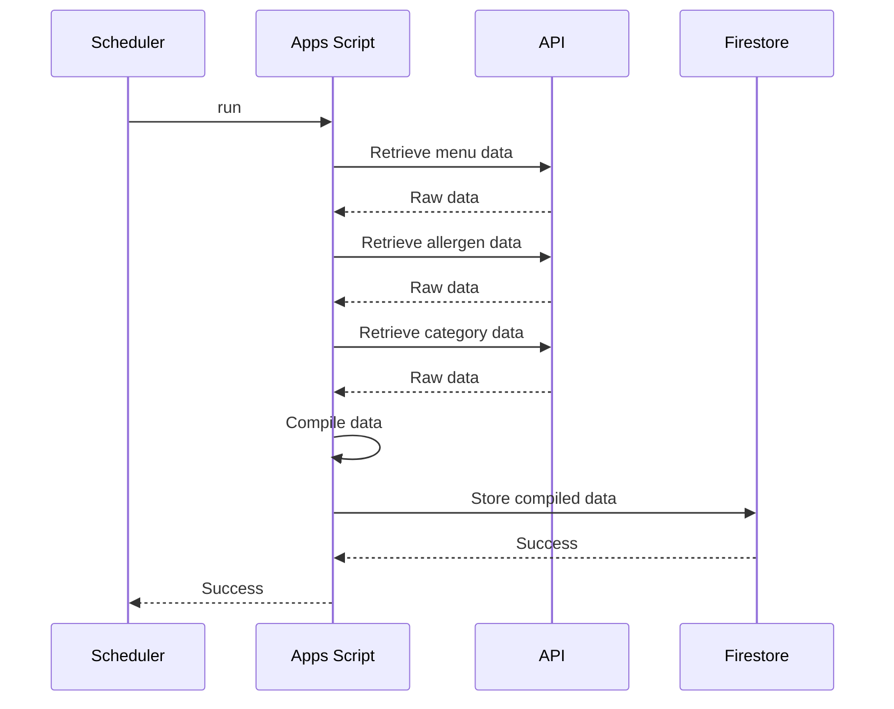
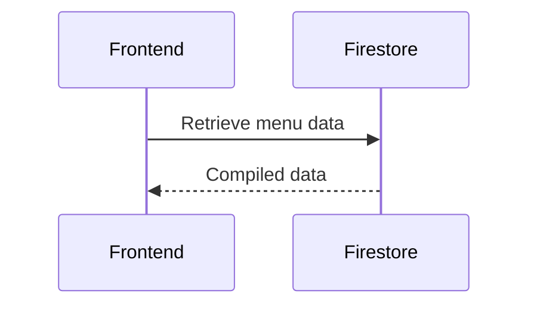

# Me & You - Newton Canteen Menu

Flutter app providing a proper web app experience to read the canteen's menu for the Newton building in Munich.
You can try it out [here](https://cestcedric.github.io/me-and-you/)!

## Architecture

The raw data used in the original [FG & More App](https://fruehaufgenuss.de/fruehauf-genuss-app/) is coming from a password protected API. The endpoints, user name and password are all hardcoded in the app and easy to find (just search for `password` in the app files).

In order to protect the access and not overload the API this app uses a custom backend, a Google Apps Script querying the API at regular intervals and storing the data in Firestore. This also enables backend compilation of info, e.g. about allergens, into a single file, instead of having the frontend make several calls and handling the mapping.

The backend implementation can be found in this second, private, [repository](https://github.com/cestcedric/newton-canteen-relay) (obviously I'm going to build a proxy backend just to then leak the password there).

### Entities

### Raw data retrieval

### Frontend interaction

## Future Work

This app does pretty much exactly what I want it to do.
However, some ideas could still be implemented:

- Filters for allergens, veggie, ...
- Feedback, rate dishes
- Favourites

## Attributions

### Icons

[Spoon icons]("https://www.flaticon.com/free-icons/sppon) created by Freepik - Flaticon
